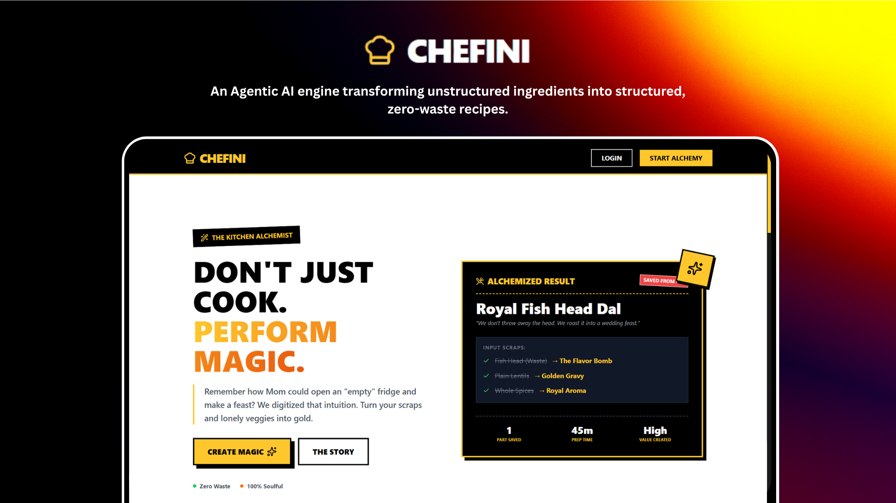

<div align="center">


[](https://twitter.com/intent/follow?screen_name=DeriaRanit)
[](https://www.linkedin.com/in/ranit-deria-916864257/)

  <br />
   <!-- Replace with your actual logo path if available, or remove -->
   <div align="center">
  
</div>
  <br />

  <h2 align="center">Computational Kitchen Companion</h2>

  <p align="center">
    Chefini is an intelligent culinary companion that turns your leftovers into gourmet meals, plans your weekly batch cooking, and scientifically rescues dishes gone wrong. Built with <strong>Next.js 16</strong> and powered by <strong>Llama 3 (Groq)</strong>, it features a bold brutalist aesthetic and practical AI tools for the modern home cook.
  </p>

  <a href="https://chefini.vercel.app/"><strong>➥ Live Demo</strong></a>

  <br />

  

</div>

## Table of Contents

- [Overview](#overview)
- [Prerequisites](#prerequisites)
- [Technologies Utilized](#technologies-utilized)
- [Features](#features)
- [Run Locally](#run-locally)
- [Deployment](#deployment)
- [Configuration](#configuration)
- [Project Structure](#project-structure)
- [Privacy & Safety](#privacy--safety)
- [License](#license)
- [Contact](#contact)

## Overview

Cooking shouldn't be stressful or wasteful. **Chefini** solves common kitchen chaos with three core pillars:

- **Resourcefulness:** Instantly generate recipes from whatever ingredients you have on hand.
- **Planning:** Create structured 3-5 day meal prep plans to save time and money.
- **Rescue:** A scientific "Flavor Rescue Lab" to fix salty, spicy, or bland dishes in real-time.

All wrapped in a high-contrast, partially accessible, and mobile-responsive **Brutalist UI**.

### Prerequisites: <a name="prerequisites"></a>

Before setting up Chefini, ensure you have:

- **[Node.js](https://nodejs.org/)** (v18.x or later)
- **[npm](https://www.npmjs.com/)** or **[pnpm](https://pnpm.io/)**
- **[MongoDB](https://www.mongodb.com/)** (Local or AtlasURI)
- **Groq Cloud Account** (for Llama 3 API)

### Technologies Utilized: <a name="technologies-utilized"></a>

- **Framework:**  Next.js 16 (App Router)
- **Language:**  TypeScript
- **Database:**  MongoDB (Mongoose)
- **Styling:**  Tailwind CSS
- **AI Engine:**  Groq SDK (Llama-3.3-70b-versatile)
- **Auth:**  NextAuth.js (v5 Beta)
- **Emails:**  Nodemailer / Resend
- **Icons:**  Lucide React
- **PDF/Image Gen:**  jsPDF & html2canvas

### Features: <a name="features"></a>

- **🪄 Leftover Magic:** Input your ingredients and get a tailored recipe instantly.
- **🥗 Intelligent Diet Filtering:** Toggle between **Veg** and **Non-Veg** recipes with instant visual feedback (🟢/🔴).
- **🔒 Edge Authentication:** Secure, lightning-fast route protection using Next.js Middleware and Auth.js.
- **🍱 Smart Meal Prep:** "Batch Compiler" creates a Sunday prep guide + daily runtime instructions for the week.
- **🎨 Premium Brutalist UI:** Custom dark-themed scrollbars and interactive elements designing for a unique experience.
- **🚑 Flavor Rescue Lab:** Too salty? Too spicy? The AI analyzes the problem and provides a chemical/culinary fix.
- **🛡️ AI Content Moderation:** Inputs are validated to prevent gibberish or offensive content.
- **📚 Digital Cookbook:** Save, categorize, and manage your favorite AI-generated recipes.
- **🛒 Smart Shopping List:** Auto-generated grocery lists from your meal plans.
- **📤 Export Options:** Download recipes and lists as high-quality PDFs or images.
- **📱 Fully Responsive:** Optimized for use on your phone while cooking.

### Run Locally: <a name="run-locally"></a>

1. **Clone the Repository:**

   ```bash
   git clone https://github.com/RanitDERIA/chefini.git
   cd chefini
   ```

2. **Install Dependencies:**

   ```bash
   npm install
   ```

3. **Environment Setup:** Create a `.env` file in the root directory:

   ```env
   # Database
   MONGODB_URI=your_mongodb_connection_string

   # AI Provider
   GROQ_API_KEY=your_groq_api_key

   # Authentication
   AUTH_SECRET=your_nextauth_secret_key

   # Email (Optional)
   EMAIL_SERVER_USER=your_email
   EMAIL_SERVER_PASSWORD=your_password
   EMAIL_SERVER_HOST=smtp.example.com
   EMAIL_SERVER_PORT=587
   EMAIL_FROM=noreply@example.com
   ```

4. **Start Development Server:**

   ```bash
   npm run dev
   ```

5. **Open Browser:** Navigate to `http://localhost:3000`.

### Deployment: <a name="deployment"></a>

Chefini is optimized for **Vercel**.

1. Push to GitHub.
2. Import project in Vercel.
3. Add Environment Variables in Vercel Dashboard.
4. Deploy.

### Configuration: <a name="configuration"></a>

- **Groq Model:** Defaults to `llama-3.3-70b-versatile` for balance of speed and creativity. Configurable in `app/api/...` routes.
- **Theme:** The "Brutalist" theme uses standard Tailwind colors extended in `tailwind.config.js` (`chefini-yellow`, `chefini-black`).

### Project Structure: <a name="project-structure"></a>

```
Chefini/
├── app/
│   ├── (auth)/                 # Authentication Routes
│   │   ├── login/
│   │   ├── signup/
│   │   └── verify-otp/
│   ├── (dashboard)/            # Protected User Interface
│   │   ├── batch/              # "Batch Cooking" Feature
│   │   ├── cookbook/           # Saved Recipes
│   │   ├── dashboard/          # Main UI + AI Generation Trigger
│   │   ├── debug/              # "Scientific Rescue" (Flavor Debugger)
│   │   └── shopping-list/      # Smart Grocery List
│   ├── api/                    # Backend API Routes
│   │   ├── generate/           # Llama 3 AI Logic Endpoint
│   │   ├── debug-dish/         # Flavor correction logic
│   │   └── recipes/            # CRUD for user recipes
│   └── landing/                # Public Landing Page
├── components/
│   ├── ui/
│   │   ├── BatchCompiler.tsx   # Logic for weekly meal planning
│   │   ├── CookMode.tsx        # Step-by-step cooking interface
│   │   ├── FlavorDebugger.tsx  # Scientific dish rescue UI
│   │   └── RecipeModal.tsx     # Recipe visualization
├── lib/
│   ├── auth.ts                 # NextAuth Configuration (Node.js)
│   ├── mongodb.ts              # Database Connection
│   └── ready-recipes.ts        # Fallback/Static recipe data
├── models/                     # Mongoose Schemas
│   ├── BatchPlan.ts
│   ├── Recipe.ts
│   ├── ShoppingList.ts
│   └── User.ts
├── auth.config.ts              # Edge-compatible Auth Config
├── middleware.ts               # Edge Middleware for Route Protection
├── public/                     # Static Assets
├── next.config.mjs             # Next.js Configuration
├── tailwind.config.js          # Styling Configuration
└── package.json                # Project Dependencies
```

### Privacy & Safety: <a name="privacy--safety"></a>

- **Content Safety:** Integrated AI moderation ensures inputs are safe and relevant to cooking.
- **Data:** User data (recipes/plans) is stored securely in MongoDB. Passwords are hashed.

### License: <a name="license"></a>

This project is licensed under the **MIT License**.

### 📬 Let's Connect

<p align="left">
  <a href="mailto:bytebardderia@gmail.com">
    
  </a>
  <a href="https://www.linkedin.com/in/ranit-deria-916864257/">
    
  </a>
  <a href="https://twitter.com/DeriaRanit">
    
  </a>
  <a href="https://github.com/RanitDERIA">
    
  </a>
</p>

---
<div align="center">

**⭐ Star this repository if you love cooking with AI!**

Made with ❤️ and 🧂 by [Ranit Deria](https://profession-folio.vercel.app)

</div>
